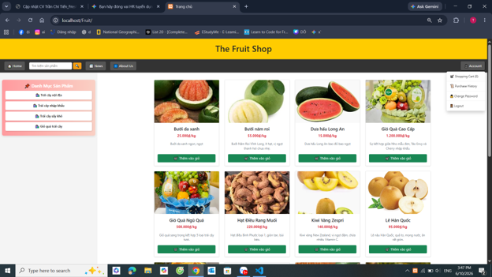
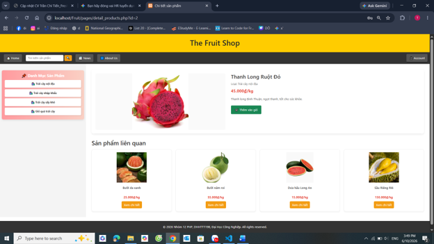
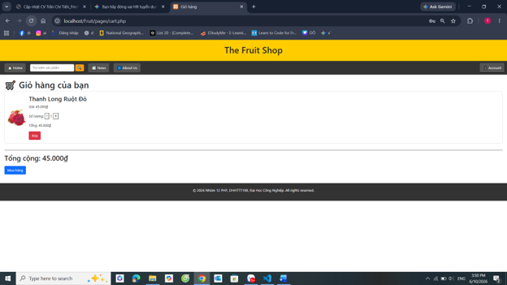
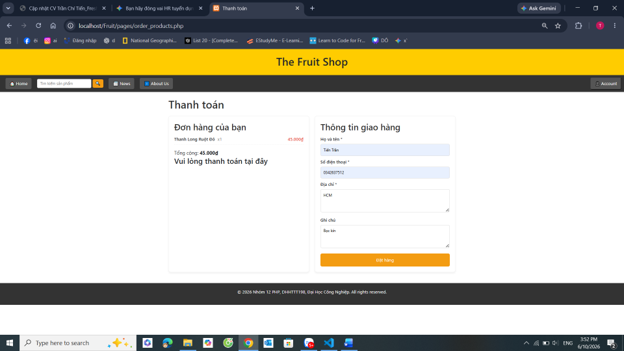
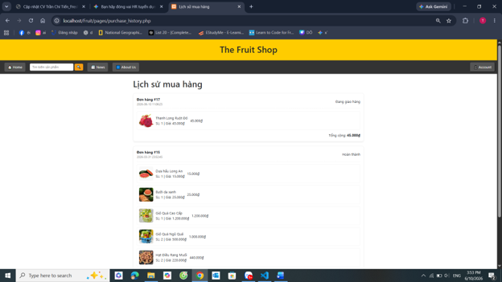
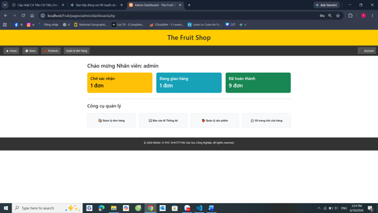
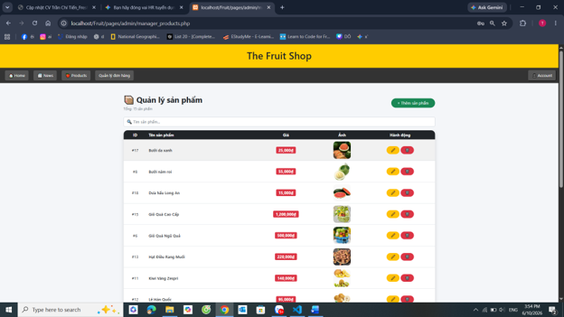
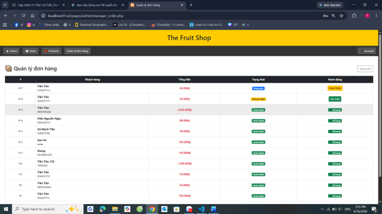

# FreshCart – Online Fruit E-Commerce & Management System


## Giới thiệu

**FreshCart** là ứng dụng web thương mại điện tử mô phỏng đầy đủ hoạt động của một cửa hàng bán trái cây trực tuyến. Dự án được xây dựng nhằm thực hành và thể hiện khả năng phát triển một hệ thống web hoàn chỉnh — từ giao diện người dùng, xử lý nghiệp vụ, đến quản trị cơ sở dữ liệu — **không sử dụng framework**, chỉ dùng PHP thuần kết hợp kiến trúc MVC tự triển khai.

**Đối tượng người dùng:**
- **Khách hàng:** Duyệt sản phẩm, đặt hàng, theo dõi đơn hàng
- **Nhân viên / Quản trị viên:** Quản lý sản phẩm, xử lý đơn hàng, xem báo cáo doanh thu

---

## Tính năng chi tiết

### Khách hàng

| Tính năng | Mô tả |
|---|---|
| Đăng ký / Đăng nhập | Xác thực tài khoản qua session |
| Trang chủ | Hiển thị toàn bộ sản phẩm với lọc danh mục và tìm kiếm |
| Chi tiết sản phẩm | Xem ảnh, mô tả, giá, thêm vào giỏ |
| Giỏ hàng | Thêm, xóa, chỉnh số lượng sản phẩm, tính tổng tiền |
| Đặt hàng | Nhập thông tin giao hàng (họ tên, SĐT, địa chỉ, ghi chú) |
| Lịch sử mua hàng | Xem toàn bộ đơn hàng đã đặt và trạng thái hiện tại |
| Đổi mật khẩu | Cập nhật mật khẩu tài khoản |

### Nhân viên / Quản trị viên

| Tính năng | Mô tả |
|---|---|
| Dashboard | Thống kê nhanh: số đơn chờ xác nhận, đang giao, hoàn thành |
| Quản lý sản phẩm | Thêm, sửa, xóa sản phẩm; upload hình ảnh; tìm kiếm |
| Quản lý đơn hàng | Xem toàn bộ đơn, cập nhật trạng thái từng bước |
| Thống kê doanh thu | Biểu đồ cột hiển thị số lượng đơn theo trạng thái, tổng doanh thu |

### Luồng trạng thái đơn hàng

```
Chờ xác nhận (0)  →  Đã thanh toán (1)  →  Đang giao hàng (2)  →  Hoàn thành (3)
```

---

## Hướng dẫn sử dụng

### Dành cho Khách hàng

1. Truy cập `http://localhost/Fruit`
2. Nhấn **Đăng ký** để tạo tài khoản mới, sau đó **Đăng nhập**
3. Duyệt sản phẩm trên trang chủ — lọc theo danh mục ở thanh bên trái hoặc dùng ô tìm kiếm
4. Nhấn vào sản phẩm để xem chi tiết, chọn **Thêm vào giỏ hàng**
5. Vào **Giỏ hàng**, kiểm tra số lượng và tổng tiền
6. Nhấn **Đặt hàng**, điền đầy đủ thông tin giao hàng → **Xác nhận đặt hàng**
7. Xem trạng thái đơn hàng tại **Lịch sử mua hàng**

### Dành cho Nhân viên / Quản trị viên

1. Đăng nhập bằng tài khoản có quyền staff (xem bảng tài khoản demo bên dưới)
2. Hệ thống tự chuyển đến trang **Dashboard** — xem tổng quan đơn hàng và biểu đồ
3. Vào **Quản lý sản phẩm** để thêm / sửa / xóa sản phẩm hoặc upload ảnh mới
4. Vào **Quản lý đơn hàng** để xem danh sách đơn, nhấn nút cập nhật trạng thái
5. Vào **Thống kê** để xem doanh thu tổng và biểu đồ số lượng đơn hàng

---

## Tài khoản demo

| Vai trò | Username | Password |
|---|---|---|
| Admin / Staff | `admin` | `1  ` |
| Khách hàng | `khachhang1` | `1` |

> **Lưu ý:** Đây là dự án học tập, mật khẩu demo được giữ ngắn để tiện thao tác.

---

## Screenshots

### Trang chủ


### Chi tiết sản phẩm


### Giỏ hàng


### Đặt hàng


### Lịch sử mua hàng


### Dashboard Admin


### Quản lý sản phẩm


### Quản lý đơn hàng


---

## Công nghệ sử dụng

| Thành phần | Công nghệ |
|---|---|
| Backend | PHP 8 (OOP, không framework) |
| Cơ sở dữ liệu | MySQL / MariaDB |
| Frontend | HTML5, CSS3, JavaScript (ES6) |
| UI Framework | Bootstrap 5.3 |
| Biểu đồ | Chart.js |
| Môi trường | XAMPP (Apache + MySQL) |
| Yêu cầu tối thiểu | PHP 7.4+ |

---

## Kiến trúc dự án

Dự án áp dụng mô hình **MVC (Model – View – Controller)** được tổ chức thủ công, không phụ thuộc framework:

```
FreshCart/
├── auth/                   — Xác thực: đăng nhập, đăng ký
├── models/                 — Nghiệp vụ & truy vấn DB
│   ├── clsUser.php         — Quản lý người dùng, phân quyền
│   ├── clsProduct.php      — Sản phẩm: CRUD, tìm kiếm, lọc
│   ├── clsCart.php         — Giỏ hàng (session-based)
│   └── clsOrder.php        — Đơn hàng, transaction, thống kê
├── controllers/            — Xử lý logic nghiệp vụ
│   ├── customer/           — Login, register, filter, auth check
│   └── staff/              — Xử lý sản phẩm, đơn hàng (staff)
├── pages/                  — Giao diện (View)
│   ├── admin/              — Dashboard, quản lý sản phẩm/đơn hàng
│   └── (customer pages)    — Giỏ hàng, đặt hàng, lịch sử, ...
├── includes/               — Kết nối DB, layout chung (header, footer)
├── bin/                    — Tài nguyên tĩnh (CSS, JS, hình ảnh)
├── fruit.sql               — Backup cơ sở dữ liệu
└── index.php               — Trang chủ
```

---

## Hướng dẫn cài đặt

**Yêu cầu:** XAMPP (hoặc bất kỳ stack LAMP/WAMP nào có PHP 7.4+ và MySQL)

1. Cài đặt **XAMPP** và khởi động **Apache** + **MySQL**
2. Sao chép thư mục `Fruit` vào `C:/xampp/htdocs/`
3. Mở **phpMyAdmin** tại `http://localhost/phpmyadmin`, tạo database tên `fruit`
4. Import file `fruit.sql` vào database vừa tạo
5. Truy cập `http://localhost/Fruit` trên trình duyệt
6. Đăng nhập bằng tài khoản demo ở bảng trên

---

## Điểm nổi bật kỹ thuật

- **Database Transaction:** Luồng đặt hàng dùng `BEGIN TRANSACTION` / `COMMIT` / `ROLLBACK` để đảm bảo tính toàn vẹn dữ liệu khi ghi đồng thời đơn hàng và chi tiết sản phẩm
- **MVC tự triển khai:** Tách biệt hoàn toàn Model – View – Controller mà không dùng framework bên ngoài
- **Role-based Authorization:** Hệ thống phân quyền 3 cấp (khách vãng lai / khách hàng / nhân viên), kiểm tra tại mọi endpoint nhạy cảm
- **Chart.js Dashboard:** Biểu đồ thống kê doanh thu và đơn hàng render động từ dữ liệu thực tế trong DB
- **Session-based Cart:** Giỏ hàng hoạt động không cần đăng nhập, đồng bộ khi người dùng xác thực

---

## Kỹ năng thể hiện qua dự án

**Kỹ thuật:**
- Lập trình PHP hướng đối tượng (OOP): class, encapsulation, separation of concerns
- Thiết kế và tối ưu schema cơ sở dữ liệu quan hệ (MySQL): JOIN, GROUP BY, transaction
- Xây dựng hệ thống xác thực & phân quyền (Authentication + Role-based Authorization)
- Xử lý form, upload file, quản lý session
- Tích hợp thư viện JavaScript bên thứ ba (Chart.js, Bootstrap 5)
- Thiết kế giao diện responsive

**Mềm:**
- Tự nghiên cứu và triển khai toàn bộ dự án từ đầu đến cuối (solo project)
- Quản lý toàn bộ vòng đời sản phẩm: phân tích yêu cầu → thiết kế DB → lập trình → kiểm thử
- Thiết kế UI/UX hướng đến trải nghiệm người dùng cuối

---

## Tác giả

**Trần Chí Tiến**
Email: trantien3791@gmail.com
